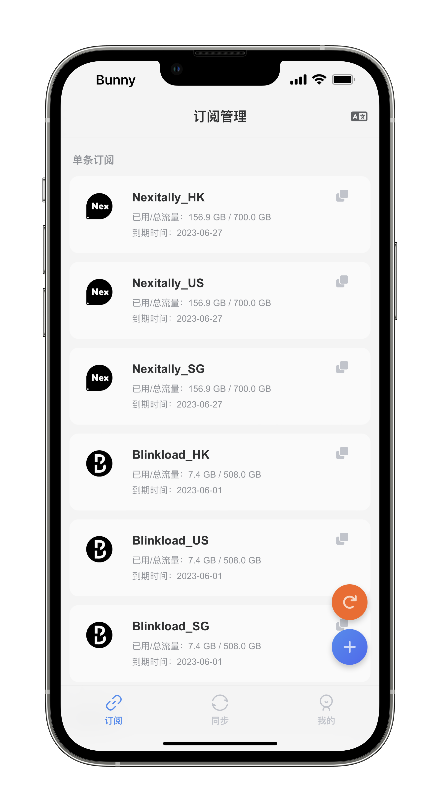

<h1 align="center">Sub-Store-Sync</h1>

<h4 align="center">一个本地的多机场节点整合、修改、自定义模块</h4>

  </img>
  </img>

## 功能
1. 可以方便的整合单个或多个机场的节点信息
2. 可以容易的对机场节点的名字、排序、筛选等进行修改
3. 可以快捷把整合好的节点信息进行多设备同步
4. 可以在后台定时将Sub-Store的订阅同步至gist

### 同步模块需要配合@Peng-YM大佬的Sub-Store本体模块一起使用
>**稳定版 :** https://raw.githubusercontent.com/Peng-YM/Sub-Store/master/config/Surge.sgmodule 

## 使用 Sub-Store
1. 安装Sub-Store模块
2. 开启MitM安装并信任证书
3. 开启脚本功能开关
4. 使用 Safari 打开这个 https://sub.store 如网页正常打开并且未弹出任何错误提示，说明 Sub-Store 已经配置成功
5. 可以把 Sub-Store 添加到主屏幕，即可获得类似于 APP 的使用体验
6. 更详细的使用指南请参考[文档](https://www.notion.so/Sub-Store-6259586994d34c11a4ced5c406264b46)

## How to use
### 1. 安装环境
**需要网络调试工具 Surge**

### 2. 安装链接
>**凌晨1点开始每6个小时同步 :** https://raw.githubusercontent.com/HuaWeixiang/NetManager/master/Surge/Module/Sub-Store-Sync/6hours.sgmodule 
>**早上5点开始每12个小时同步 :** https://raw.githubusercontent.com/HuaWeixiang/NetManager/master/Surge/Module/Sub-Store-Sync/12hours.sgmodule 
>**凌晨1点开始每24个小时同步 :** https://raw.githubusercontent.com/HuaWeixiang/NetManager/master/Surge/Module/Sub-Store-Sync/24hours.sgmodule 

**通常情况下建议使用「凌晨1点开始每24个小时同步」这个版本**

### 3. 安装方式
>Surge首页 -> 通用 -> 模块 -> 安装新模块... -> 复制粘贴上方的安装链接 -> 完成......

### 4. 更新方式
**此模块更新需分别更新模块和脚本**
>**模块更新 :** Surge首页 -> 通用 -> 模块 -> 找到并左滑本模块 -> 更新 -> 完成...... 
>**脚本更新 :** Surge首页 -> 点击最上方打开 Profile 页面 -> 外部资源 -> 全部更新|(找到并左滑相关脚本 -> 更新) -> 完成......

**建议两次更新之间 _ 间隔 5 分钟以上_，否则有可能页面缓存文档尚未更新导致更新失败，可通过查看代码的方式来确认是否更新成功**
>**模块代码查看 :** Surge首页 -> 通用 -> 模块 -> 找到并点击本模块详情 -> 查看代码是否与网页版本相同 
>**脚本代码查看 :** Surge首页 -> 修改 -> 脚本的编辑器 -> 载入 -> 找到并点击相关脚本 -> 查看代码是否与网页版本相同
