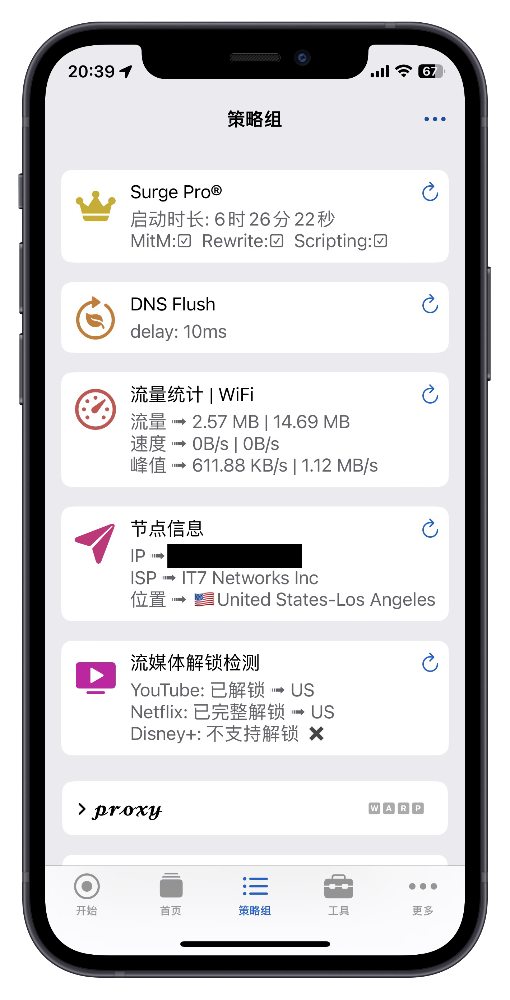
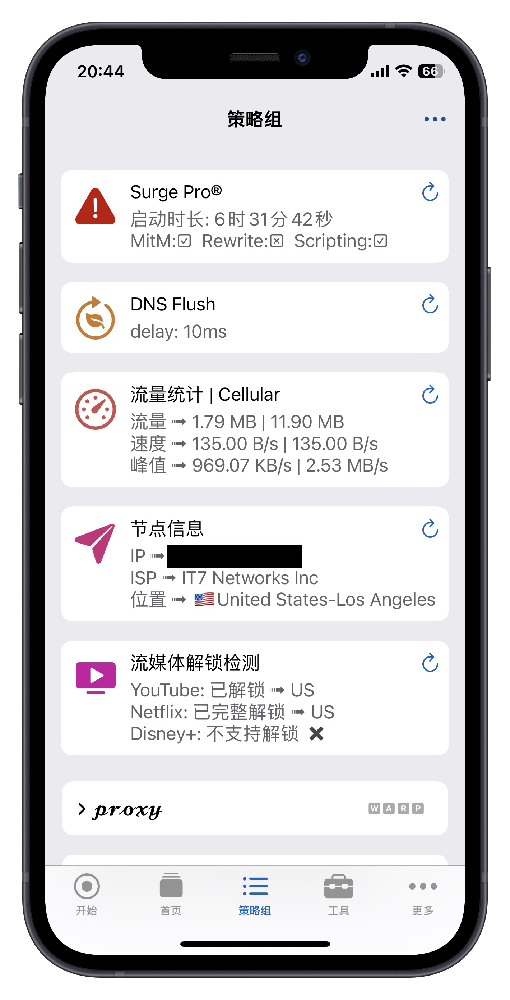

<h1 align="center">Panels</h1>

<h4 align="center">一个组合了SurgePro-ReloadProfiles、FlushDNS、TrafficStatistics、IP-Check、Stream-All的面板</h4>

  </img>
  </img>

## 功能
**SurgePro-ReloadProfiles** 可显示Surge启动时长，可显示MitM、Rewrite、Scripting是否开启，刷新还能重载配置 
**FlushDNS** 可显示当前使用的DNS的延迟情况，刷新还能清除DNS缓存 
**TrafficStatistics** 可显示流量、当前网速、峰值网速，刷新可切换显示蜂窝网络的流量、当前网速、峰值网速 
**IP-Check** 可显示当前节点IP信息、运营商信息、所在地信息 
**Stream-All** 可显示当前节点是否解锁了所在地的YouTube、Netflix、DisneyPlus

## How to use
### 1. 安装环境
**需要网络调试工具Surge付费至具有面板功能**
>**最低支持版本 :** 
>**AppStore版4.9.3或更新版本** 
>**TestFlight版4.11.0或更新版本**

### 2. 安装链接
>**Panels :** https://raw.githubusercontent.com/HuaWeixiang/NetManager/master/Surge/Panel/Panels.sgmodule

### 3. 安装方式
>Surge首页 -> 通用 -> 模块 -> 安装新模块... -> 复制粘贴上方的安装链接 -> 完成......

### 4. 更新方式
**Panel更新需分别更新模块和脚本**
>**模块更新 :** Surge首页 -> 通用 -> 模块 -> 找到并左滑本模块 -> 更新 -> 完成...... 
>**脚本更新 :** Surge首页 -> 点击最上方打开Profile页面 -> 外部资源 -> 全部更新|(找到并左滑相关脚本 -> 更新) -> 完成......

**建议两次更新之间 _ 间隔5分钟以上，否则有可能页面缓存文档尚未更新导致更新失败，可通过查看代码的方式来确认是否更新成功**
>**模块代码查看 :** Surge首页 -> 通用 -> 模块 -> 找到并点击本模块详情 -> 查看代码是否与网页版本相同 
>**脚本代码查看 :** Surge首页 -> 修改 -> 脚本的编辑器 -> 载入 -> 找到并点击相关脚本 -> 查看代码是否与网页版本相同
