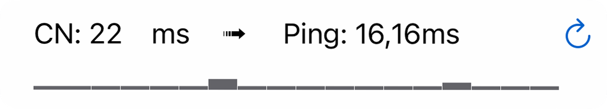
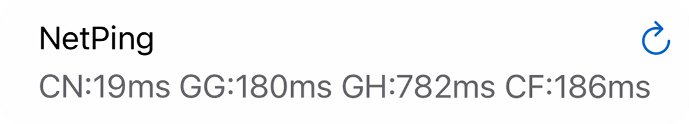

<h1 align="center">Panel</h1>

<h3 align="center">SurgePro</h3>
<p align="center">
  </img>
  </img>
</p>

```ruby
[Panel]
# > Surge Pro®,可显示启动时间,显示MitM、Rewrite、Scripting是否开启,点击刷新为重载配置或刷新DNS缓存
# SurgePro = script-name=SurgePro,update-interval=1
SurgePro = script-name=SurgePro,update-interval=1
[Script]
# > Surge Pro®可显示启动时间,显示MitM、Rewrite、Scripting是否开启,-ReloadProfiles点击重载配置,-FlushDNS点击刷新DNS缓存
# 可选参数"title=xxx" 可以自定义标题
# 可选参数"icon=xxx" 可以自定义图标,内容为任意有效的 SF Symbol Name,如"&icon=crown.fill",详细可以下载app https://apps.apple.com/cn/app/sf-symbols-browser/id1491161336
# 可选参数"color=xxx" 可以自定义图标颜色,内容为颜色的HEX编码,如"&color=#ffd700"
# SurgePro = type=generic,timeout=3,script-path=https://raw.githubusercontent.com/HuaWeixiang/NetManager/master/Surge/Panel/Scripts/SurgePro-ProfilesReload.js,script-update-interval=0,argument=title=Surge Pro®&icon=crown.fill&color=#ffd700
# SurgePro = type=generic,timeout=3,script-path=https://raw.githubusercontent.com/HuaWeixiang/NetManager/master/Surge/Panel/Scripts/SurgePro-DNSFlush.js,script-update-interval=0,argument=title=Surge Pro®&icon=crown.fill&color=#ffd700
SurgePro = type=generic,timeout=3,script-path=https://raw.githubusercontent.com/HuaWeixiang/NetManager/master/Surge/Panel/Scripts/SurgePro-ProfilesReload.js,script-update-interval=0
```

<h3 align="center">ProfilesReload</h3>
<p align="center">
  </img>
</p>

```ruby
[Panel]
# > 配置重载
# ProfilesReload = script-name=ProfilesReload,update-interval=-1
ProfilesReload = script-name=ProfilesReload,update-interval=-1
[Script]
# > 配置重载
# 可选参数"title=xxx" 可以自定义标题
# 可选参数"icon=xxx" 可以自定义图标,内容为任意有效的 SF Symbol Name,如"&icon=leaf.arrow.circlepath",详细可以下载app https://apps.apple.com/cn/app/sf-symbols-browser/id1491161336
# 可选参数"color=xxx" 可以自定义图标颜色,内容为颜色的HEX编码,如"&color=#ff9933"
# ProfilesReload = type=generic,timeout=3,script-path=https://raw.githubusercontent.com/HuaWeixiang/NetManager/master/Surge/Panel/Scripts/ProfilesReload.js,script-update-interval=0,argument=title=Profiles Reload&icon=leaf.arrow.circlepath&color=#ff9933
ProfilesReload = type=generic,timeout=3,script-path=https://raw.githubusercontent.com/HuaWeixiang/NetManager/master/Surge/Panel/Scripts/ProfilesReload.js,script-update-interval=0
```

<h3 align="center">DNSFlush</h3>
<p align="center">
  </img>
</p>

```ruby
[Panel]
# > DNS刷新
# DNSFlush = script-name=DNSFlush,update-interval=-1
DNSFlush = script-name=DNSFlush,update-interval=-1
[Script]
# > DNS刷新
# 可选参数"title=xxx" 可以自定义标题
# 可选参数"icon=xxx" 可以自定义图标,内容为任意有效的 SF Symbol Name,如"&icon=leaf.arrow.circlepath",详细可以下载app https://apps.apple.com/cn/app/sf-symbols-browser/id1491161336
# 可选参数"color=xxx" 可以自定义图标颜色,内容为颜色的HEX编码,如"&color=#ff9933"
# DNSFlush = type=generic,timeout=3,script-path=https://raw.githubusercontent.com/HuaWeixiang/NetManager/master/Surge/Panel/Scripts/DNSFlush.js,script-update-interval=0,argument=title=DNS Flush&icon=leaf.arrow.circlepath&color=#ff9933
DNSFlush = type=generic,timeout=3,script-path=https://raw.githubusercontent.com/HuaWeixiang/NetManager/master/Surge/Panel/Scripts/DNSFlush.js,script-update-interval=0
```

<h3 align="center">TrafficStatistics</h3>
<p align="center">
  </img>
  </img>
</p>

```ruby
[Panel]
# > 流量统计,点击以切换网络界面
# TrafficStatistics = script-name=TrafficStatistics,update-interval=1
TrafficStatistics = script-name=TrafficStatistics,update-interval=1
[Script]
# > 流量统计,点击以切换网络界面
# 可选参数"title=xxx" 可以自定义标题
# 可选参数"icon=xxx" 可以自定义图标,内容为任意有效的 SF Symbol Name,如"&icon=speedometer",详细可以下载app https://apps.apple.com/cn/app/sf-symbols-browser/id1491161336
# 可选参数"color=xxx" 可以自定义图标颜色,内容为颜色的HEX编码,如"&color=#ff6666"
#TrafficStatistics = type=generic,timeout=3,script-path= https://raw.githubusercontent.com/HuaWeixiang/NetManager/master/Surge/Panel/Scripts/TrafficStatistics.js,script-update-interval=0,argument=title=流量统计&icon=speedometer&color=#ff6666
TrafficStatistics = type=generic,timeout=3,script-path= https://raw.githubusercontent.com/HuaWeixiang/NetManager/master/Surge/Panel/Scripts/TrafficStatistics.js,script-update-interval=0
```

<h3 align="center">Network</h3>
<p align="center">
  </img>
  </img>
</p>

```ruby
[Panel]
# > 网络信息
# Network = script-name=Network,update-interval=1
Network = script-name=Network,update-interval=1
[Script]
# > 网络信息
# 可选参数"color=xxx" 可以自定义图标颜色,内容为颜色的HEX编码,如"&color=#ff3399"
# Network = type=generic,timeout=10,script-path=https://raw.githubusercontent.com/HuaWeixiang/NetManager/master/Surge/Panel/Scripts/Network.js,script-update-interval=0,argument=color=#ff3399
Network = type=generic,timeout=10,script-path=https://raw.githubusercontent.com/HuaWeixiang/NetManager/master/Surge/Panel/Scripts/Network.js,script-update-interval=0
```

<h3 align="center">NetIP</h3>
<p align="center">
  </img>
</p>

```ruby
[Panel]
# > 节点信息
# NetIP = script-name=NetIP,update-interval=-1
NetIP = script-name=NetIP,update-interval=-1
[Script]
# > 节点信息
# 可选参数"title=xxx" 可以自定义标题
# 可选参数"icon=xxx" 可以自定义图标,内容为任意有效的 SF Symbol Name,如"&icon=paperplane.fill",详细可以下载app https://apps.apple.com/cn/app/sf-symbols-browser/id1491161336
# 可选参数"color=xxx" 可以自定义图标颜色,内容为颜色的HEX编码,如"&color=#ff3399"
# NetIP = type=generic,timeout=10,script-path=https://raw.githubusercontent.com/HuaWeixiang/NetManager/master/Surge/Panel/Scripts/NetIP.js,script-update-interval=0,argument=title=节点信息&icon=paperplane.fill&color=#ff3399
NetIP = type=generic,timeout=10,script-path=https://raw.githubusercontent.com/HuaWeixiang/NetManager/master/Surge/Panel/Scripts/NetIP.js,script-update-interval=0
```

<h3 align="center">StreamsCheck</h3>
<p align="center">
  </img>
</p>

```ruby
[Panel]
# > 流媒体解锁检测
# StreamsCheck = script-name=StreamsCheck,update-interval=-1
StreamsCheck = script-name=StreamsCheck,update-interval=-1
[Script]
# > 流媒体解锁检测
# 可选参数"title=xxx" 可以自定义标题
# 可选参数"icon=xxx" 可以自定义图标,内容为任意有效的 SF Symbol Name,如"&icon=play.tv.fill",详细可以下载app https://apps.apple.com/cn/app/sf-symbols-browser/id1491161336
# 可选参数"color=xxx" 可以自定义图标颜色,内容为颜色的HEX编码,如"&color=#ff00cc"
# StreamsCheck = type=generic,timeout=30,script-path=https://raw.githubusercontent.com/HuaWeixiang/NetManager/master/Surge/Panel/Scripts/StreamsCheck.js,script-update-interval=0,argument=title=流媒体解锁检测&icon=play.tv.fill&color=#ff00cc
StreamsCheck = type=generic,timeout=30,script-path=https://raw.githubusercontent.com/HuaWeixiang/NetManager/master/Surge/Panel/Scripts/StreamsCheck.js,script-update-interval=0
```

<h3 align="center">WARP</h3>
<p align="center">
  </img>
</p>

```ruby
[Panel]
# > WARP信息
☁ WARP Panel = title="WARP Info", icon="lock.icloud.fill", "icon-color": "#cc00ff", script-name=☁ WARP Panel
[Script]
# > WARP信息
#!PROFILE-VERSION-REQUIRED 10 ☁ WARP Panel = type=generic, timeout=15, script-path=https://raw.githubusercontent.com/VirgilClyne/Cloudflare/main/js/Cloudflare.1.1.1.1.panel.js
# WARP Personal
☁ WARP Personal Request = type=http-request,pattern=^https?:\/\/(api|zero-trust-client)\.cloudflareclient\.com\/(.*)\/reg\/[0-9a-f]{8}-[0-9a-f]{4}-[0-5][0-9a-f]{3}-[089ab][0-9a-f]{3}-[0-9a-f]{12}$, requires-body=1, script-path=https://raw.githubusercontent.com/VirgilClyne/Cloudflare/main/js/Cloudflare.1.1.1.1.request.js
☁ WARP Personal Response = type=http-response,pattern=^https?:\/\/(api|zero-trust-client)\.cloudflareclient\.com\/(.*)\/reg\/[0-9a-f]{8}-[0-9a-f]{4}-[0-5][0-9a-f]{3}-[089ab][0-9a-f]{3}-[0-9a-f]{12}$, requires-body=1, script-path=https://raw.githubusercontent.com/VirgilClyne/Cloudflare/main/js/Cloudflare.1.1.1.1.response.js
# Cloudflare for Teams
☁ WARP Teams Request = type=http-request,pattern=^https?:\/\/(api|zero-trust-client)\.cloudflareclient\.com\/(.*)\/reg\/t\.[0-9a-f]{8}-[0-9a-f]{4}-[0-5][0-9a-f]{3}-[089ab][0-9a-f]{3}-[0-9a-f]{12}$, requires-body=1, script-path=https://raw.githubusercontent.com/VirgilClyne/Cloudflare/main/js/Cloudflare.1.1.1.1.request.js
☁ WARP Teams Response = type=http-response,pattern=^https?:\/\/(api|zero-trust-client)\.cloudflareclient\.com\/(.*)\/reg\/t\.[0-9a-f]{8}-[0-9a-f]{4}-[0-5][0-9a-f]{3}-[089ab][0-9a-f]{3}-[0-9a-f]{12}$, requires-body=1, script-path=https://raw.githubusercontent.com/VirgilClyne/Cloudflare/main/js/Cloudflare.1.1.1.1.response.js
[MITM]
hostname = %APPEND% api.cloudflareclient.com, zero-trust-client.cloudflareclient.com
```

<h3 align="center">AirportSubscribe</h3>
<p align="center">
  </img>
</p>

```ruby
[Panel]
# > 机场订阅信息
# AirportSubscribe = script-name=AirportSubscribe,update-interval=3600
AirportSubscribe = script-name=AirportSubscribe,update-interval=3600
[Script]
# > 机场流量信息
# 必须参数"url=xxx" 先将带有流量信息的节点订阅链接encode,用encode后的链接替换"url="后面的[机场节点链接]
# 可选参数"reset_day=xxx" 后面的数字替换成流量每月重置的日期,如1号就写1,8号就写8,如"&reset_day=1",不加该参数不显示流量重置信息
# 可选参数"expire=xxx" 机场链接不带expire信息的,可以手动传入expire参数,如"&expire=2030-02-01",注意一定要按照yyyy-MM-dd的格式;不希望显示到期信息也可以添加"&expire=false"取消显示
# 可选参数"title=xxx" 可以自定义标题
# 可选参数"icon=xxx" 可以自定义图标,内容为任意有效的 SF Symbol Name,如"&icon=airplane",详细可以下载app https://apps.apple.com/cn/app/sf-symbols-browser/id1491161336
# 可选参数"color=xxx" 可以自定义图标颜色,字段内容为颜色的HEX编码,如"&color=#9933ff"
# 注: 有些服务端不支持head访问,可以添加参数"&method=get"
# AirportSubscribe = type=generic,timeout=10,script-path=https://raw.githubusercontent.com/HuaWeixiang/NetManager/master/Surge/Panel/Scripts/AirportSubscribe.js,script-update-interval=0,argument=url=[URL encode 后的机场节点链接]&reset_day=1&title=MyAirplane&icon=airplane&color=#9933ff
AirportSubscribe = type=generic,timeout=10,script-path=https://raw.githubusercontent.com/HuaWeixiang/NetManager/master/Surge/Panel/Scripts/AirportSubscribe.js,script-update-interval=0,argument=[URL encode 后的机场节点链接]&reset_day=1&title=MyAirplane
```

<h3 align="center">NetPingCN</h3>
<p align="center">
  </img>
</p>

```ruby
[Panel]
# > NetPingCN
# NetPingCN = script-name=NetPingCN,update-interval=-1
NetPingCN = script-name=NetPingCN,update-interval=-1
[Script]
# > NetPingCN
# NetPingCN = type=generic,timeout=3,script-path=https://raw.githubusercontent.com/HuaWeixiang/NetManager/master/Surge/Panel/Scripts/NetPingCN.js,script-update-interval=0
NetPingCN = type=generic,timeout=3,script-path=https://raw.githubusercontent.com/HuaWeixiang/NetManager/master/Surge/Panel/Scripts/NetPingCN.js,script-update-interval=0
```

<h3 align="center">NetPingUS</h3>
<p align="center">
  </img>
</p>

```ruby
[Panel]
# > NetPingUS
# NetPingUS = script-name=NetPingUS,update-interval=-1
NetPingUS = script-name=NetPingUS,update-interval=-1
[Script]
# > NetPingUS
# NetPingUS = type=generic,timeout=3,script-path=https://raw.githubusercontent.com/HuaWeixiang/NetManager/master/Surge/Panel/Scripts/NetPingUS.js,script-update-interval=0
NetPingUS = type=generic,timeout=3,script-path=https://raw.githubusercontent.com/HuaWeixiang/NetManager/master/Surge/Panel/Scripts/NetPingUS.js,script-update-interval=0
```

<h3 align="center">NetIPLite</h3>
<p align="center">
  </img>
</p>

```ruby
[Panel]
# > NetIPLite
# NetIPLite = script-name=NetIPLite,update-interval=-1
NetIPLite = script-name=NetIPLite,update-interval=-1
[Script]
# > NetIPLite
# 可选参数"title=xxx" 可以自定义标题
# NetIPLite = type=generic,timeout=3,script-path=https://raw.githubusercontent.com/HuaWeixiang/NetManager/master/Surge/Panel/Scripts/NetIPLite.js,script-update-interval=0,argument=title=NetIP
NetIPLite = type=generic,timeout=3,script-path=https://raw.githubusercontent.com/HuaWeixiang/NetManager/master/Surge/Panel/Scripts/NetIPLite.js,script-update-interval=0
```

<h3 align="center">NetPing</h3>
<p align="center">
  </img>
</p>

```ruby
[Panel]
# > NetPing
# NetPing = script-name=NetPing,update-interval=-1
NetPing = script-name=NetPing,update-interval=-1
[Script]
# > NetPing
# 可选参数"title=xxx" 可以自定义标题
# NetPing = type=generic,timeout=3,script-path=https://raw.githubusercontent.com/HuaWeixiang/NetManager/master/Surge/Panel/Scripts/NetPing.js,script-update-interval=0,argument=title=NetPing
NetPing = type=generic,timeout=3,script-path=https://raw.githubusercontent.com/HuaWeixiang/NetManager/master/Surge/Panel/Scripts/NetPing.js,script-update-interval=0
```

<h3 align="center">NetSpeed</h3>
<p align="center">
  </img>
</p>

```ruby
[Panel]
# > NetSpeed
# NetSpeed = script-name=NetSpeed,update-interval=-1
NetSpeed = script-name=NetSpeed,update-interval=-1
[Script]
# > NetSpeed
# 可选参数"mb=xxx" 每次测试消耗的流量,经测试最大可设置4MB参数"mb=4",默认1MB
# 可选参数"title=xxx" 可以自定义标题
# NetSpeed = type=generic,timeout=3,script-path=https://raw.githubusercontent.com/HuaWeixiang/NetManager/master/Surge/Panel/Scripts/NetSpeed.js,script-update-interval=0,argument=mb=1&title=NetSpeed
NetSpeed = type=generic,timeout=3,script-path=https://raw.githubusercontent.com/HuaWeixiang/NetManager/master/Surge/Panel/Scripts/NetSpeed.js,script-update-interval=0
```

<h3 align="center">CFGPT</h3>
<p align="center">
  </img>
</p>

```ruby
[Panel]
# > CFGPT
# CFGPT = script-name=CFGPT,update-interval=-1
CFGPT = script-name=CFGPT,update-interval=-1
[Script]
# > CFGPT
# 可选参数"title=xxx" 可以自定义标题
# CFGPT = type=generic,timeout=3,script-path=https://raw.githubusercontent.com/HuaWeixiang/NetManager/master/Surge/Panel/Scripts/CFGPT.js,script-update-interval=0,argument=title=CFGPT
CFGPT = type=generic,timeout=3,script-path=https://raw.githubusercontent.com/HuaWeixiang/NetManager/master/Surge/Panel/Scripts/CFGPT.js,script-update-interval=0
```

<h3 align="center">StreamsCheckLite</h3>
<p align="center">
  </img>
</p>

```ruby
[Panel]
# > 流媒体解锁检测
# StreamsCheckLite = script-name=StreamsCheckLite,update-interval=-1
StreamsCheckLite = script-name=StreamsCheckLite,update-interval=-1
[Script]
# > 流媒体解锁检测
# 可选参数"title=xxx" 可以自定义标题
# StreamsCheckLite = type=generic,timeout=30,script-path=https://raw.githubusercontent.com/HuaWeixiang/NetManager/master/Surge/Panel/Scripts/StreamsCheckLite.js,script-update-interval=0,argument=title=StreamsCheck
StreamsCheckLite = type=generic,timeout=30,script-path=https://raw.githubusercontent.com/HuaWeixiang/NetManager/master/Surge/Panel/Scripts/StreamsCheckLite.js,script-update-interval=0
```

## How to use
### 1. 安装环境
**需要网络调试工具Surge付费至具有面板功能**
>**最低支持版本 :**<br>
>**AppStore版4.9.3或更新版本**<br>
>**TestFlight版4.11.0或更新版本**

### 2. 安装方式
>Surge首页 -> 通用 -> 模块 -> 安装新模块... -> 复制粘贴上方的安装链接 -> 完成......

### 3. 更新方式
**Panel更新需分别更新模块和脚本**
>**模块更新 :** Surge首页 -> 通用 -> 模块 -> 找到并左滑本模块 -> 更新 -> 完成......<br>
>**脚本更新 :** Surge首页 -> 点击最上方打开Profile页面 -> 外部资源 -> 全部更新|(找到并左滑相关脚本 -> 更新) -> 完成......

**建议两次更新之间 _ 间隔5分钟以上，否则有可能页面缓存文档尚未更新导致更新失败，可通过查看代码的方式来确认是否更新成功**
>**模块代码查看 :** Surge首页 -> 通用 -> 模块 -> 找到并点击本模块详情 -> 查看代码是否与网页版本相同<br>
>**脚本代码查看 :** Surge首页 -> 修改 -> 脚本的编辑器 -> 载入 -> 找到并点击相关脚本 -> 查看代码是否与网页版本相同

